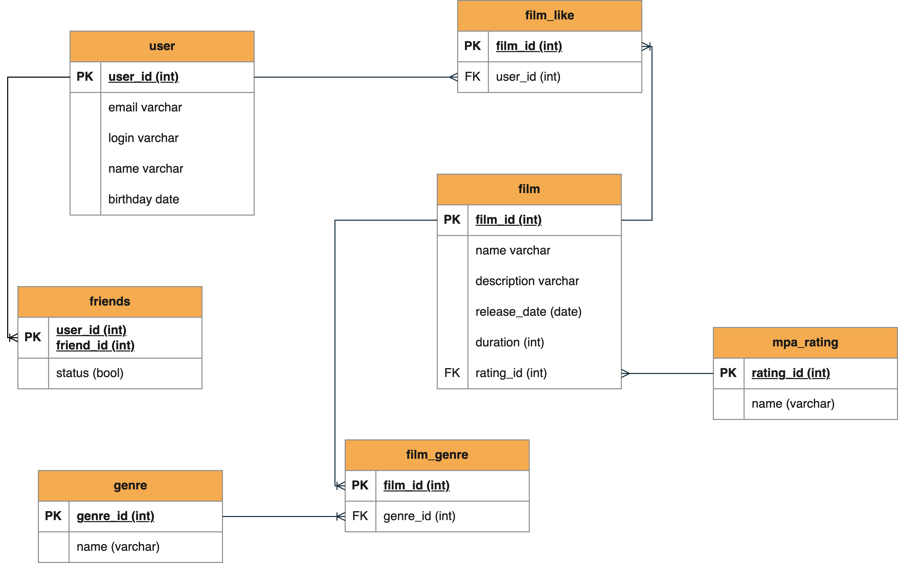

# java-filmorate
Template repository for Filmorate project.

# Описание диаграммы
* Для описания пользователей, поставивших лайк фильму, реализована таблица "film_like".
* Для описания отношений дружбы между пользователями реализована таблица friends, где первичным ключом является
составной ключ из id двух пользователей.
* Для жанров фильмов создана таблица film_genre, которая является соединительной таблицей к genre, содержащей id и имя жанра, например,
Action, comedy, thriller и т. п.

# Примеры запросов для основных операций
* Получение топ 10 самых популярных фильмов
```roomsql
SELECT * FROM film
WHERE film_id IN (SELECT film_id
FROM (SELECT film_id, COUNT(film_id) as likes
FROM film_like
GROUP BY film_id
ORDER BY likes DESC
LIMIT 10));
```
* Получение списка общих друзей с другим пользователем.
```roomsql
SELECT friend_id as common
FROM (SELECT friend_id FROM user
WHERE user_id = 1 AND status = 'true'
UNION ALL
SELECT friend_id FROM user
WHERE user_id = 2 AND status = 'true')
GROUP BY common
HAVING COUNT(common) >= 2;
```
* Получение всех фильмов.
```roomsql
SELECT * FROM film;
```
* Получение всех пользователей
```roomsql
SELECT * FROM user;
```
